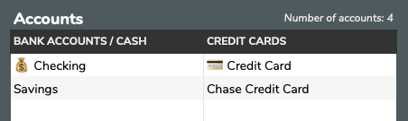
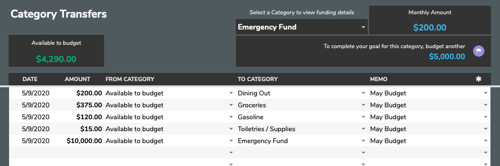

# Getting Started

📺 Visit Aspire's [YouTube channel](https://www.youtube.com/c/AspireBudgeting) for tutorial videos

### 📌 A few important things about Google Sheets and Aspire before you get started

* Because of how Google Sheets handles data and conditional formatting, it is highly recommended that you not move data around by cutting and pasting. Copying and pasting is fine in most situations but be aware that some formatting may be copied along with your text and this may make text less legible. Because of this, it's often easier to retype data if there's lots of existing formatting in the source text.
* Inserting or deleting rows is not recommended as it can modify existing formulas and formatting. However, it is possible to add more rows to pages by using the **Add more rows** button at the bottom of the page. This may be helpful on the **Transactions**, **Category Transfers**, and reporting tabs.
* Aspire has many fields that contain formulas and data; these fields should not be edited. To see which fields are interactable and which tables are meant to contain user added data, select the **Highlight all editable fields and tables** option on the **Configuration** tab. These editable cells and tables will be highligted like the example below.

## Localizing Aspire's currency and dates

Aspire offers tools to update the entire sheet into a currency and date format of your choosing. Review the [Localization Tools](spreadsheet-tabs/localization-tools.md) docs for how to complete this process.

## Configuring Accounts and Categories

Getting your accounts and categories configured is the first step on your Aspire journey. A few categories and accounts have already been added by default. For this Getting Started section, we'll walk through some examples with these defaults.

Before updating/changing any of the categories and their corresponding details, you may want to review the [Configuration](spreadsheet-tabs/configuration.md) docs.

If you're new to budgeting, it's best to make your categories generic. As you get a feel for budgeting, you can make adjustments to refine your categories. And don't fret about forgetting anything - new categories can be added at any time!

## Initializing Accounts

Once you have your categories set up, you can begin to add your account details to Aspire. In the Accounts section, under the appropriate header, simply add in the names by which you refer to your accounts. These accounts will be the accounts you will record transactions against and use for monthly budgeting. Some accounts like student loans, mortgages, or other non-credit card debt will be better tracked in the Net Worth Reports tab as they are not 'budget' accounts.

After you've added your accounts to the **Configuration** tab, you'll need to initialize them. Let's initialize all of our accounts by creating **➡️Starting Balance** transactions.

## Funding Categories

Next, you need to move funds from your **Available to budget** category into your other Categories. This will allow you to assign funds to each Category and when you add Transactions to Aspire, the **Dashboard** will update accordingly. Like mentioned above, this is equivalent to taking money you have and placing it in an envelope. The section on the top right will help you plan your budgets each month by showing you how much to transfer into the selected Category \(if the selected Category has a Monthly Amount set\).

## Adding Transactions

After your Categories have been funded, we can begin to spend some of those funds! Let's add a few sample transactions just to get a feel for things.

That's it! Those are the basics of Aspire. At this point, you're ready to setup a few Categories, add some sample Transactions, and get a feel for everything. Like mentioned above, we have a great community on Reddit with loads of people ready to help - so stop by and say hello!

