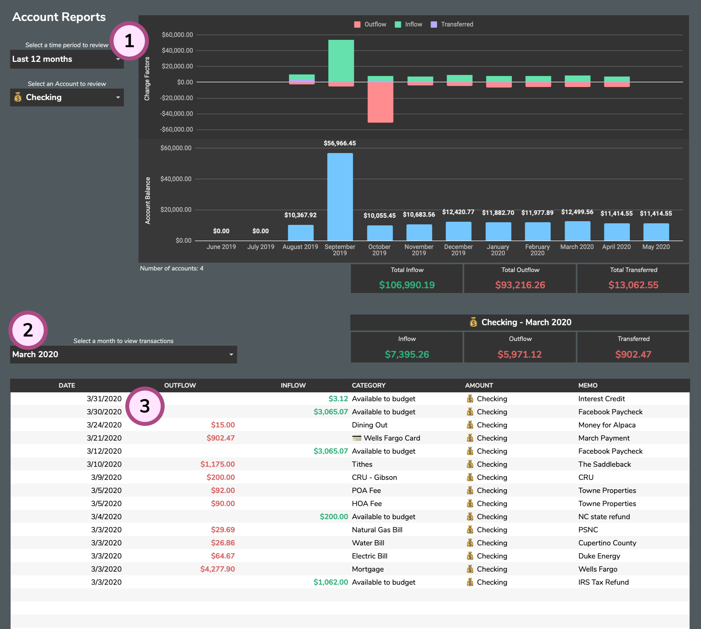

# Account Reports

The **Account Reports** tab will help you review the history of your Account's balances and activity.

1. **Option Selectors**: These selectors will let you drill down into a specific time period and account for review.
2. **Month Selector**: See transaction data for the selected month for the account selected above.
3. **Account Reports Table**: This table will contain your transactions and activity for the selected account and month.

