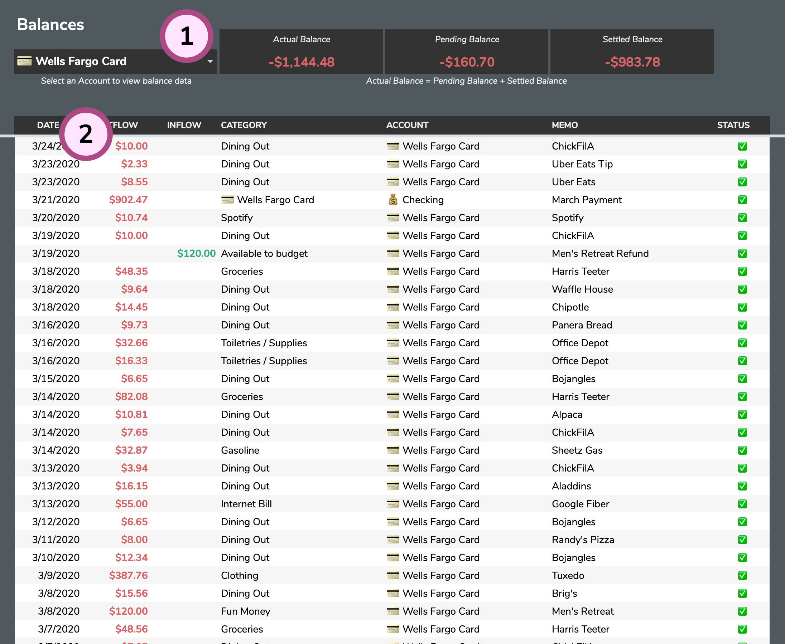

# Balances

The **Balances** tab can help you break down your transactions for any account.

1. **Account Selector**: By selecting an Account, you can see that Account's activity broken down by **Settled** and **Pending** Transactions.
2. **Balances Table**: This table will show your Transactions for the selected account in reverse chronological order.

