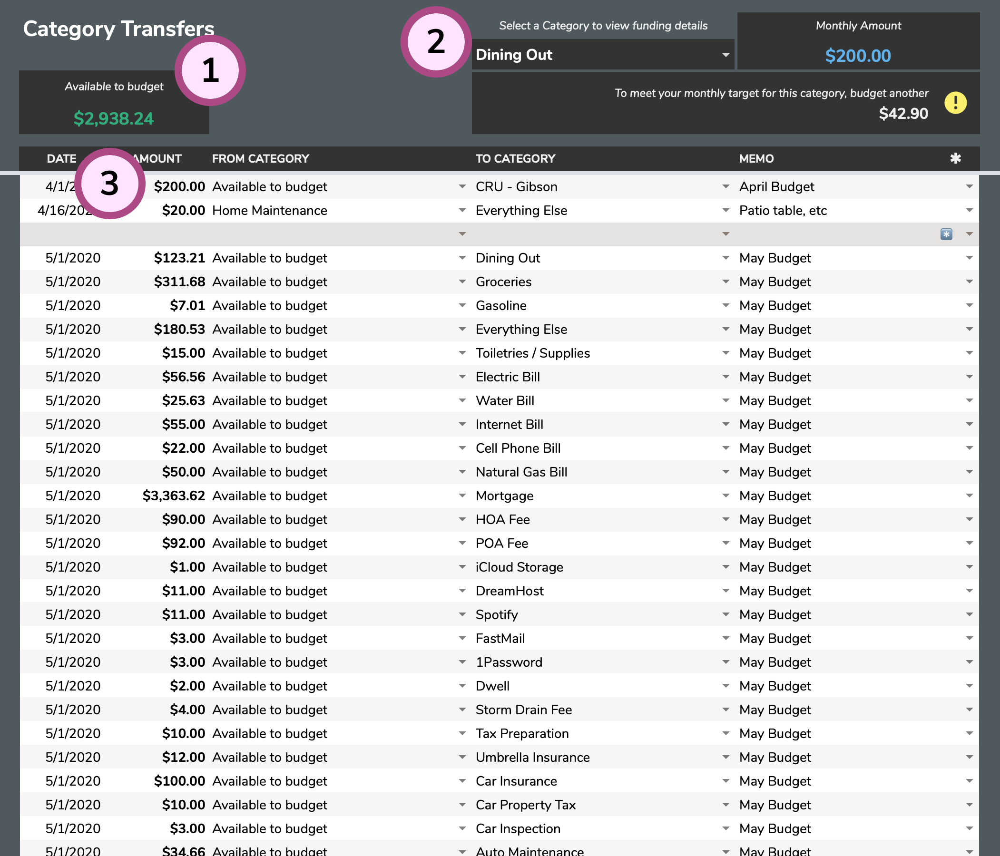

# Category Transfers

The **Category Transfers** tab is how you will move funds between your Categories.

1. **Available to budget amount**: This amount indicates how much money you have available to allocate to your various Categories. It will update automatically as you move money around.
2. **Category Selector**: This area will help you as you plan your budget. When you select a category, you will see the Category's **Monthly Amount** and details on funding for the current month.
3. **Category Transfers Table**: This table is where you will add your transfers and move money between all of your Categories.

