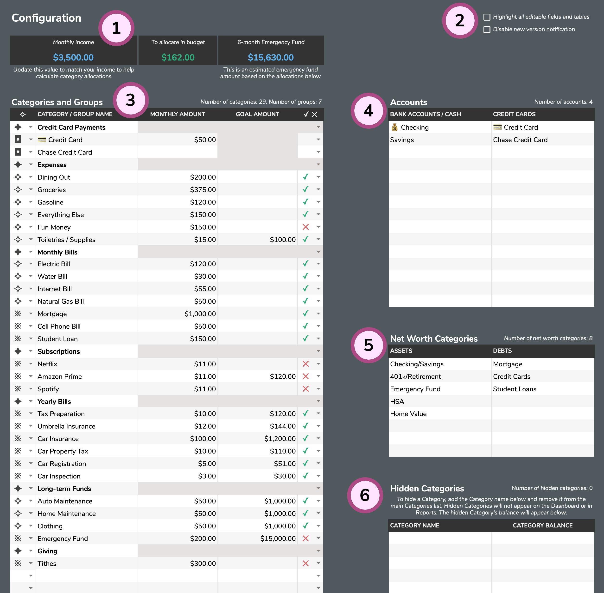

# Configuration

The **Configuration** tab is the home to all of your budget's core details. This tab is where you will customize your **Categories and Groups**, add your **Accounts**, record your **Net Worth Categories**, and hide unused Categories and Accounts.

1. **Helper Tools**: Aspire comes with a few helper tools at the top of the **Configuration** tab. To begin, simply enter your monthly income \(a rough estimate is fine\) and the other two values will update automatically as you make changes to the **Categories and Groups** table. As you set up the **Monthly Amount** for all your Categories, you'll see the **To allocate in budget** amount adjust up/down. The objective is to get this amount as close to zero as possible without going negative - this means you're budgeting every dollar and giving every dollar a job. The dropdowns next to each Category can be used to calculate your **6-month Emergency Fund** \(for your awareness as you plan your budget\). **✓** indicates **Include in calculation** and **✕** indicates **Do not include in calculation**. Some Categories you have in your budget might be "treats" or "quality of life" categories that you might not fund in an emergency situation \(such as losing a job\) - that's why you have the option to not include them in the Emergency Fund calculation.
2. **Aspire Settings**: These are two global settings in Aspire. The **Highlight all editable fields and tables** setting will shade all of the fields and tables in Aspire that you are intended to interact with and add data to. The **Disable new version notification**, when enabled, will turn off the yellow "new update" message \(as new versions become available\) on the **Dashboard**.
3. **Categories and Groups**: This section is where you will specify exactly how you want to set up your budget.
   * Select **✦** to create a **Category Group**. This is the name/title you give to a group or collection of Categories. While not required, using Category Groups can help with organizing your budget.
   * Select **✧** to create a **Reportable Category**. This type of Category will appear in all of Aspire's reports.
   * Select **※** to create a **Non-reportable Category**. A Non-reportable Category will not appear in any of the Reports \(all Categories are shown in **Category Reports**\). Use this for categories you never care/want to see in Reports.
   * Select **◘** to create a **Credit Card Category**. This is a special type of Category that represents your payment to your [Credit Cards](../credit-cards/basic-usage.md).

While possible, it is not advised to modify any Category or Account names after you've started logging Transactions. Monthly Amounts and Goal Amounts can be updated at any time and Categories and Groups can be rearranged whenver you like. New Categories and Groups can also be added at any point in time.

* **Monthly Amount**: This is the monetary amount that you want in a Category at the start of every month. The Category Transfers tab is used to help you prepare your monthly budgets by moving funds between Categories. This value is not required but creating a Monthly Amount for each Category will help when planning your budget.
* **Goal Amount**: This is the "target" funding or "goal" for a particular Category. Setting a Goal Amount is never required but it helpful for sinking funds, long-term savings, yearly bills, or other situations where saving across multiple months is necessary. Categories with a Goal will show a ⚑ indicator on the Dashboard.

To explain how all of these relate to one another, imagine a plain physical envelope. When you create a Category in Aspire, it's akin to taking a plain envelope and writing the name of your Category on it. A Monthly Amount is equivalent to writing on the same envelope an amount that you plan to put in the envelope at the start of every month. The Goal Amount is the second number you write on the outside of some \(not all\) envelopes. Goals are used to save money across multiple months with a target in mind.

1. **Accounts**: Accounts are broken down into two sections. **Bank Accounts / Cash** hold your money and assets while **Credit Cards**, as expected, are debts.
2. **Net Worth Categories**: These categories encompass all of your assets and debts \(both budgeted and non-budgeted\). Categories can be as broad or as narrow as you prefer depending on your particular situation.
3. **Hidden Categories** and **Hidden Accounts**: These are old Categories or Accounts that you no longer use. They can be added to their repsective sections to "retire" them and remove them from your primary budget.

