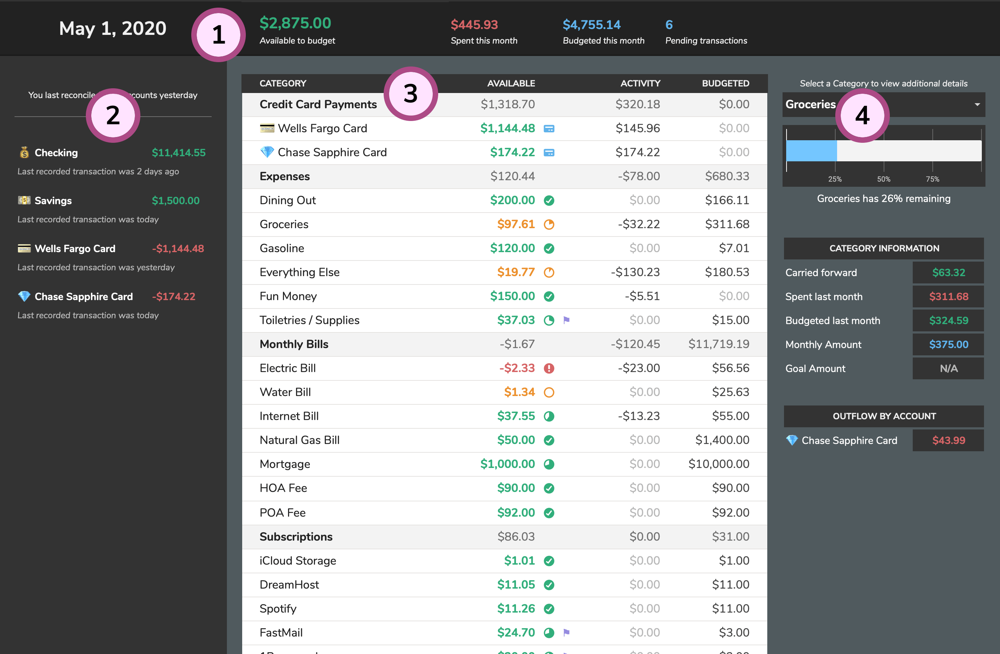

# Dashboard

The **Dashboard** is probably best described as a bird's eye view of your budget. On the **Dashboard** tab, you'll see an overview of your Accounts, your Category's balances and activity, your **Available to budget** balance, and more.

1. **Budget Overview**: The overview strip across the top of the tab will help you keep an eye on some of you budget's more granular details like how much you've spent and what funds you have that are available to budget.
2. **Accounts**: This sidebar will show an overview of all of your Accounts including their balances and recent activity.
3. **Category Table**: This table contains pertinent information on your Category's existing balances and activity. A **⚑** icon represents your Categories that have a **Goal Amount** set. The mini pie charts show a graphical representation of your remaining balance and how that relates to the **Monthly Amount** set for that Category.
4. **Category Details**: The dropdown selector allows you to display additional details for a selected Category such as the amount carried over from the last month, the amount spent last month, and a breakdown of the Category's outflows by account.

