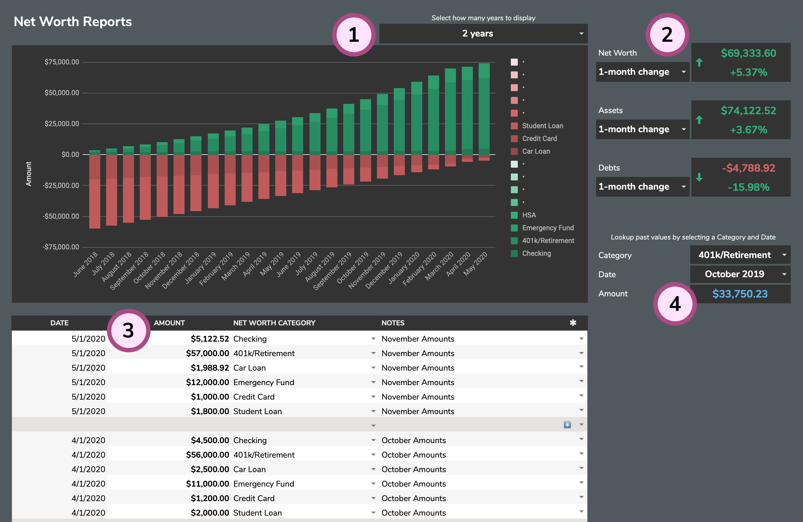

# Net Worth Reports

The **Net Worth Reports** tab can help you track your net worth over many years. Each month, simply record the balances of the categories you defined.

1. **Years Selector**: Select a range of years to visualize in the graph below.
2. **Net Worth Selectors**: With these options, you can see how your overall net worth, assets, and debts have changed over time.
3. **Net Worth Reports Table**: You can add your net worth data to the table each month and the graph above will update automatically with the new data.
4. **Lookup Feature**: Review past values of your categories by selecting a Net Worth Category and date.

