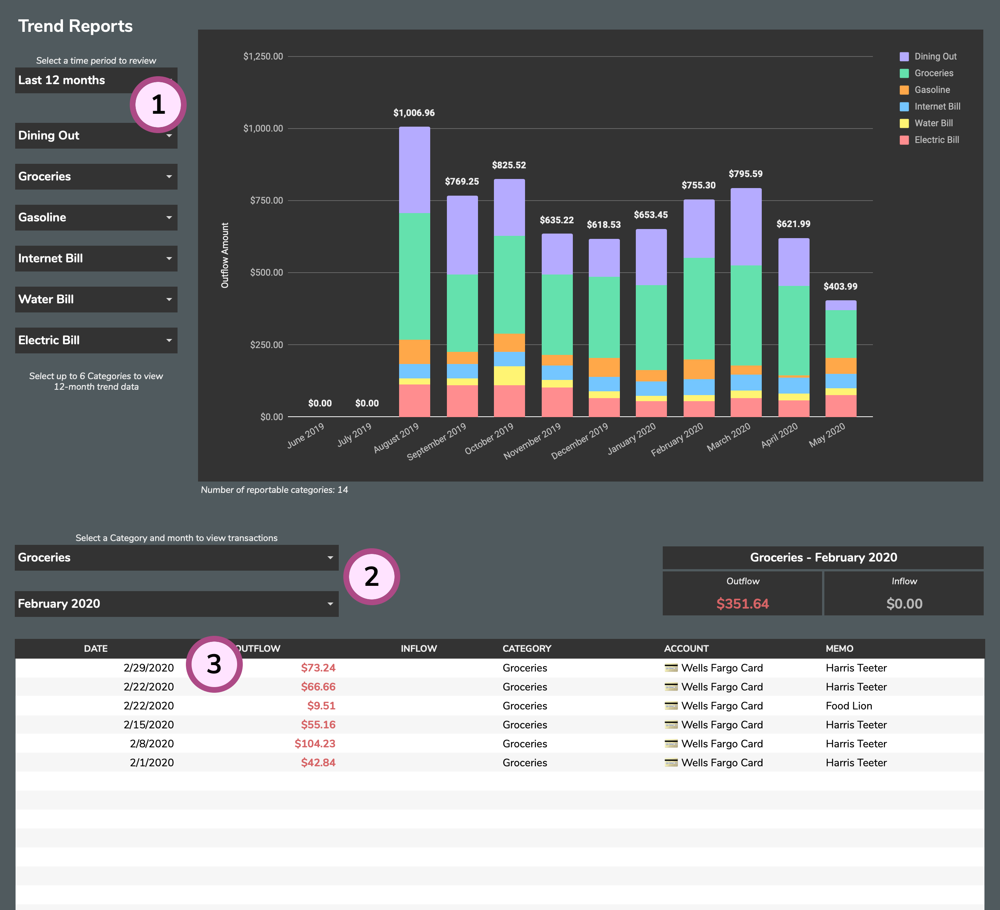

# Trend Reports

The **Trend Reports** tab will allow you to see activity trends in your Categories.

1. **Option Selectors**: These selectors will let you drill down into a specific time period and categories for review.
2. **Granular Selectors**: These additional selectors will help you narrow your focus by isolating one category and month for review.
3. **Trend Reports Table**: This table will show the transaction and activity data for the selected category and month.

